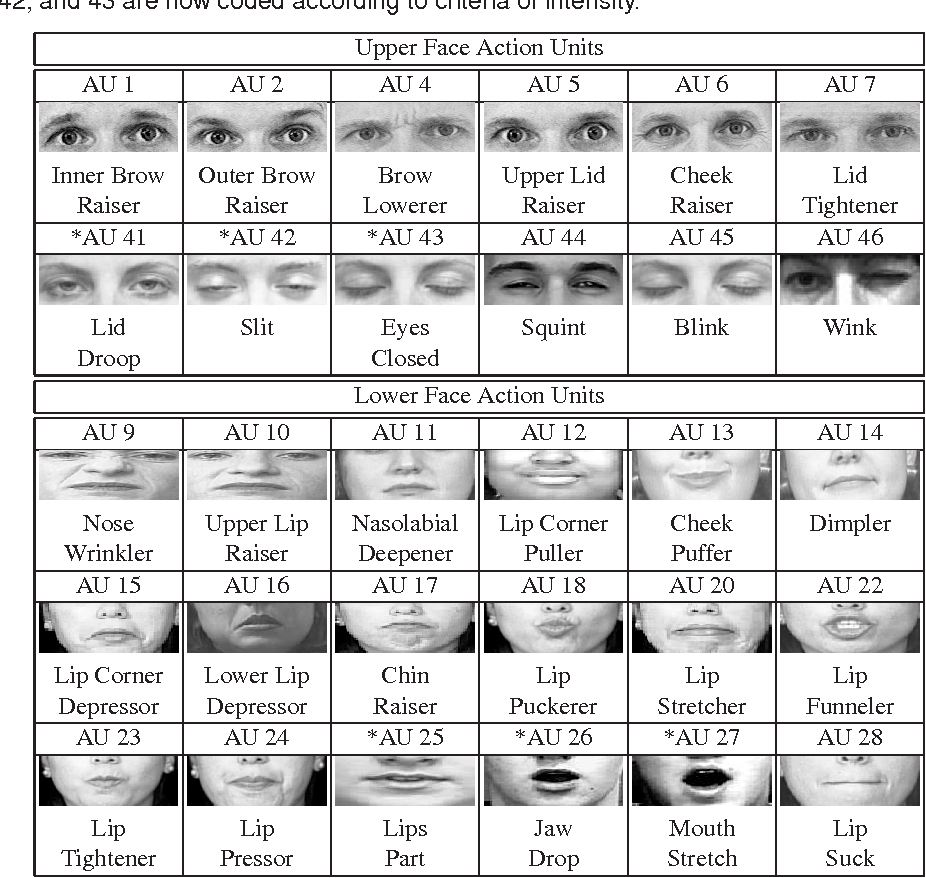

# Face Swap Metrics - A Quantitative Evaluation Framework of Video De-Identification Methods

The code used to produce the results for the publication [**"A Quantitative Evaluation Framework of Video De-Identification Methods"**](https://ieeexplore.ieee.org/abstract/document/9412186).

We live in an era of privacy concerns, motivating a large research effort in face de-identification. As in other fields, we are observing a general movement from hand-crafted methods to deep learning methods, mainly involving generative models. Although these methods produce more natural de-identified images or videos, the mere evaluation of the de-identification is not sufficient, especially when it comes to processing the images/videos further. Taking into account the issue of preserving privacy, facial expressions, and photo-reality simultaneously, we develop a general testing framework.

In particular, the three evaluation metrics are:

+ the **de-identification** itself, quantifiable as the capability of fooling face verification methods;
+ the **expression preservation**, measurable in terms of elicitation of the same Action Units (AUs) in both the original and the de-identified videos;
+ the **photo-reality** safe-guard, that we will measure in terms of feature preservation.

## Metrics Implementation

The procedure of face swap in videos proceeds by considering a *source subject* and a *destination subject* and training a model that, given a video sequence of a *source subject* will replace their identity with that of a *destination subject*.

To quantify **de-identification**, given two reference images, one of *source subject* and another of the *destination subject*, using a face recognition tool face descriptors can be calculcated for the two respective identities. Given a de-identified video, taking a set number of frames at random and producing the face embeddings for each frame, a distance measure from the resulting embeddings to the embeddings of the two identities can be calculated, respectively. The average distances over the frames indicate how successful de-identification was. One would want a low average distance to the *destination subject*, and a high average distance to the *source subject*.

Action Units (AUs) identify the fundamental muscle movements of the human face, and consequently, they can be considered as a proxy for the overall facial expressions. To quantify **expression preservation**, AUs (namely AUs 1, 2, 4, 5, 6, 7, 9, 10, 12, 14, 15, 17, 20, 23, 25, 26, 45) are extracted for the *source video* and the *destination video*, after which, Pearson's Correlation Coefficient (PCC) and the Root Mean Square Error (RMSE) are calculated. One would ideally want a value as close as possible to 1 for PCC, meaning better correlation, and a value as close as possible to 0 for RMSE, meaning that AU activation intensities are preserved.

To evaluate the quality of a generated image, and in particular, to measure the preservation of image features, the [**Fréchet Inception Distance**](http://papers.nips.cc/paper/7240-gans-trained-by-a-two-time-scale-update-rule-converge-to-a-local-nash-equilibrium.pdf) (FID) is calculated, a metric that aims at measuring the distance between the activation distributions of a CNN generic layer (generally a deep layer), feeding the CNN with either generated or original images. Generally, the FID value is lower if the original and generated images produce similar activation weights in a specific layer. FID has been described and frequently applied to assess the quality of generated images, with the extension to video sequences introduced in [this work](https://arxiv.org/pdf/1808.06601.pdf).

For **de-identification**, we adopt the [face_recognition](https://github.com/ageitgey/face_recognition/) tool, for **expression preservation** [OpenFace](https://github.com/TadasBaltrusaitis/OpenFace/) is used to extract the action units, and for **photo-reality** the [Fréchet Inception Distance](http://papers.nips.cc/paper/7240-gans-trained-by-a-two-time-scale-update-rule-converge-to-a-local-nash-equilibrium.pdf) is calculated using the [Keras implementation](https://github.com/dlpbc/keras-kinetics-i3d) (including pretrained weights) of the Inflated 3D Inception architecture reported in the paper [Quo Vadis, Action Recognition? A New Model and the Kinetics Dataset](https://arxiv.org/abs/1705.07750).

## Installation

To start install Python3.6+, clone the repository, and install the package dependencies with

```shell script
pip install -r requirements.txt
```

To download the model run [download_model_weights.sh](download_model_weights.sh) from the root directory of the project

```shell script
sh download_model_weights.sh
```

In case you're in a non-UNIX OS, run

```shell script
wget https://github.com/dlpbc/keras-kinetics-i3d/releases/download/v0.2/rgb_inception_i3d_imagenet_and_kinetics_tf_dim_ordering_tf_kernels.h5 -P model/
```

from the project root directory to download model weights placing them into the [models/](models) directory.

The code calls OpenFace to extract action units through the script [extract_action_units_docker.sh](fsmetric/extract_action_units_docker.sh) by running it in a Docker container. To install Docker follow the instructions [here](https://docs.docker.com/get-docker/). In case you're in a non-UNIX OS or intend to run a local installation of OpenFace, be sure to create a custom shell script in functionality akin to [extract_action_units_docker.sh](fsmetric/extract_action_units_docker.sh), and later on use, pass it as an argument to [main.py](main.py).

By default, the code uses TensorFlow as the Keras backend. However, the I3D network easily admits also a Theano Backend. To set it, in [requirements.txt](requirements.txt) replace "tensorflow" for "theano" and set the Keras backend accordingly following the instructions [here](https://keras.io/api/utils/backend_utils/).

## Usage

The code can be run in two ways, as a standalone Python program or it can be used as a package in other code.

The input data the code expects are the input video (-A) and the de-identified video (-B). If one wishes to produce the **de-identification** metrics, one also has to provide a **clear frontal face image** of both the *source subject* (--A_enc) and the *destination subject* (--B_enc). By convention, even though they can be swapped, the *source subject* and the *source video* are referred to as subject A, while the *destination subject* and the *destination video* are referred to as subject B.

To run the example provided run

```shell script
 python main.py -A example/src_video.mp4 -B example/dest_video.mp4 -o out.json --A_enc example/src_actor.png --B_enc example/dest_actor.png --num_frames 10 --openface fsmetric/extract_action_units_docker.sh --model_dir models/ -v all
```

which will produce outputs in out.json.

The positional argument is a list of arguments specifying the metrics to be calculated from ['deid', 'attr_pres', 'photo-reality'], or a single value *'all'* to calculate all of the metrics. Thus, to evaluate **photo-reality** and **attribute preservation** only one would run

```shell script
 python main.py -A example/src_video.mp4 -B example/dest_video.mp4 -o out.json --openface fsmetric/extract_action_units_docker.sh --model_dir models/ -v photo-reality attr_pres
```

For a comprehensive detailed list of command line arguments run

```shell script
python main.py --help
```

Bear in mind that it is quite likely that if running Docker, Docker will require superuser permissions. It that is the case, this will also bleed over to [main.py](main.py), as it calls Docker through a shell script.

Make sure that a face is present in a substantial number of frames. In case there are no frames containing faces in any of the two videos, there is a risk the script will end up in an infinite loop. Also, the code assumes that only a single person is present and will produce dubious results on video sequences containing multiple persons.

For use of the code as a package see the example below.

## Example

The examples contain a short source video of an actress from the [RAVDESS](https://zenodo.org/record/1188976#.Xwb7_pbRY5k) dataset, and a corresponding de-identified video, along with their respective images to be used to generate face encodings. The de-identification was purposefully performed poorly (low number of epochs) with [DeepFaceLab](https://github.com/iperov/DeepFaceLab) to illustrate more vividly the utility and necessity of quantifiable 
metrics in video de-identification methods.  

The following example describes fully the functionality and interface of the package. We start by importing the necessary packages and defining the parameters.

```python
import os
import tempfile

# suppress all TF logs except ERROR
os.environ["TF_CPP_MIN_LOG_LEVEL"] = "2"
import tensorflow

import fsmetric


VIDEO_SRC_PATH = "example/src_video.mp4"
VIDEO_DEST_PATH = "example/dest_video.mp4"
SRC_ENCODING = "example/src_actor.png"
DEST_ENCODING = "example/dest_actor.png"

NUM_FRAMES = 10 
OPENFACE_SCRIPT_PATH = "fsmetric/extract_action_units_docker.sh"
MODEL_DIR = "models/"
```

The *calculate_face_recognition_distances* function takes a video, two subject face images and the number of frames to extract from the video for comparison of the encodings. It returns a dictionary giving (among others) the mean of the distances for the two images from the video frames, and the
standard deviations.

In the example below we get the **de-identification** results for both the source and destination videos.

```python
A_deid_results = fsmetric.calculate_face_recognition_distances(
    vid_path=VIDEO_SRC_PATH,
    A_enc_path=SRC_ENCODING,
    B_enc_path=DEST_ENCODING,
    num_frames=NUM_FRAMES
)
print(
    f"A_mean: {A_deid_results['A_mean']}; A_std: {A_deid_results['A_std']}; " 
    f"B_mean: {A_deid_results['B_mean']}; B_std: {A_deid_results['B_std']};"
)

B_deid_results = fsmetric.calculate_face_recognition_distances(
    vid_path=VIDEO_DEST_PATH,
    A_enc_path=SRC_ENCODING,
    B_enc_path=DEST_ENCODING,
    num_frames=NUM_FRAMES
)
print(
    f"A_mean: {B_deid_results['A_mean']}; A_std: {B_deid_results['A_std']}; " 
    f"B_mean: {B_deid_results['B_mean']}; B_std: {B_deid_results['B_std']};"
)
```

It should produce results similar to the following:

```text
A_mean: 0.3787839874325053; A_std: 0.04092248640187325; B_mean: 0.8538140231194683; B_std: 0.028514389568149768;
A_mean: 0.8753754131828414; A_std: 0.026405124383163312; B_mean: 0.4366872263942618; B_std: 0.041358160875370246;
```

Taking 0.6 as the [threshold value](https://github.com/ageitgey/face_recognition/blob/0961fd1aaf97336e544421318fcd4b55feeb1a79/examples/face_distance.py) for recognition, we can see that in both the source video (first line) and the destination video (second line) the identities are unambiguous - the de-identification was successful even at low epochs.

We proceed by evaluating the **expression preservation**. The function *run_openface_script* runs OpenFace on a video and places the results in a temporary folder through a shell script. When verbosity is True, it allows the CLI output of OpenFace to be printed on the screen. *get_attribute_preservation_metrics* instead takes the two .csv files produced and calculates per action unit the PCC and RMSE for the two videos.

The output is a Python dictionary with the following keys:

```python
ACTION_UNITS = [
    "au1", "au2", "au4", "au5", "au6", "au7", "au9",
    "au10", "au12", "au14", "au15", "au17",
    "au20", "au23", "au25", "au26", "au45"
]
```

and the values for each key are a list of two floats, the first for the PCC value, and the second for RMSE.

```python
# tempfile is used because we don't want to keep the OpenFace
#  outputs, we just want our results of PCC and RMSE over the differnet AUs.
with tempfile.TemporaryDirectory() as temp_dir_path:
    A_vid_AUs_path = fsmetric.run_openface_script(
        openface_script_path=OPENFACE_SCRIPT_PATH,
        input_vid_path=VIDEO_SRC_PATH,
        output_folder_path=temp_dir_path,
        verbose=False
    )
    B_vid_AUs_path = fsmetric.run_openface_script(
        openface_script_path=OPENFACE_SCRIPT_PATH,
        input_vid_path=VIDEO_DEST_PATH,
        output_folder_path=temp_dir_path,
        verbose=False
    )

    attribute_preservation_results = fsmetric.get_attribute_preservation_metrics(
        A_vid_AUs_path=A_vid_AUs_path,
        B_vid_AUs_path=B_vid_AUs_path,
    )
    print(attribute_preservation_results)
```

It should produce the following results:

```json
{
    "au1":  [0.6938998711327988, 0.5319226803697488],
    "au2":  [0.87513857552618, 1.4071647657835518], 
    "au4":  [0.5101234274663354, 0.40320263475374846],
    "au5":  [0.24396449327280942, 3.662377366849022],
    "au6":  [0.014927700460047698, 0.19907048959868417],
    "au7":  [0.4519379585003367, 0.8822802947581446],
    "au9":  [0.5446895451225255, 0.3612393592119699],
    "au10": [0.15869301119464713, 0.7781931735659311],
    "au12": [0.43215085974517076, 0.513590650348462],
    "au14": [0.1533633379585937, 0.5447381032566027],
    "au15": [0.11938793199981904, 0.334251939372622],
    "au17": [0.33854267395730236, 0.22596106867866544],
    "au20": [-0.04944085490055206, 1.298421790212697],
    "au23": [0.023713257875366937, 0.3160103409898727],
    "au25": [0.7430184029490904, 0.5852270847634623],
    "au26": [0.2975327029012112, 0.48916581123703945],
    "au45": [0.5884449695416747, 1.3847285724549847]
}
```

Extremely poor results for both the PCC and RMSE were obtained for AUs 5 and 20. PCC was furthermore low for AUs 6, 14, 15 and 23, while the RMSE was high for AUs 2 and 45.

Observing the map below we note that both the correlation and intensity preservation are scarce for the eye area, with correlation also struggling with certain mouth movements (AUs 14, 15 and 23).



The function *calculate_video_FID* takes as input the path to the two videos and the paths to the two trained models, and outputs a single float representing the FID.

```python
fid = fsmetric.calculate_video_FID(
    video_path_source=VIDEO_SRC_PATH,
    video_path_dest=VIDEO_DEST_PATH,
    cascade_classifier_config_path=os.path.join(
        MODEL_DIR, fsmetric.CASCADE_CLASSIFIER_CONFIG_FILENAME
    ),
    weights_path=os.path.join(
        MODEL_DIR, fsmetric.WEIGHTS_FILENAME
    )
)
print(f"FID: {fid}")
```  

The output of the above should be the following:

```text
FID: 20.59342591118218
```

As FID in the ideal case is near zero, its very high value points that the photo-reality of de-identification is poor. This was to be expected as the de-identification was performed with few training epochs.

## Publication

For an deeper insight into the foundations and workings of the method and benchmark values for interpreting the results, see the accompanying publication. If you found the work useful for your research, please cite:

```bibtex
@inproceedings{bursic2021quantitative,
  title={A quantitative evaluation framework of video de-identification methods},
  author={Bursic, Sathya and D'Amelio, Alessandro and Granato, Marco and Grossi, Giuliano and Lanzarotti, Raffaella},
  booktitle={2020 25th international conference on pattern recognition (ICPR)},
  pages={6089--6095},
  year={2021},
  organization={IEEE}
}
```

## License

+ All the code in this repository is licensed under the [MIT license](LICENSE) as specified by the LICENSE file.
+ The I3D pretrained weights derive from the ones released by [Deepmind](https://deepmind.com) in [this repository](https://github.com/deepmind/kinetics-i3d) under the [Apache-2.0 License](https://github.com/deepmind/kinetics-i3d/blob/master/LICENSE).
+ The license for the OpenCV [haarcascade trained classifier](models/haarcascade_frontalface_default.xml) can be found at the top of the file.
+ To see the license for OpenFace click [here](https://github.com/TadasBaltrusaitis/OpenFace/blob/master/Copyright.txt).
+ The RAVDESS dataset is licensed under the [Creative Commons Attribution license](https://creativecommons.org/licenses/by/3.0/us/).
